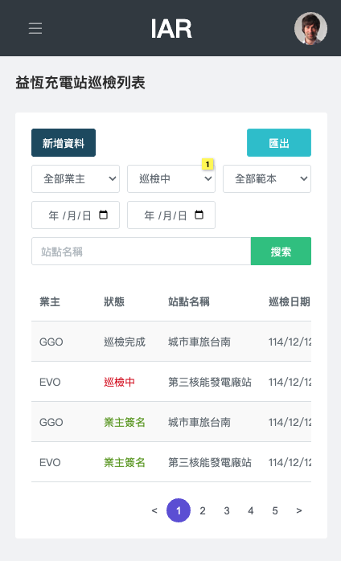

# 益恆充電站巡檢系統




- [RP](https://nq7sil.axshare.com/?id=ojdwnz&p=login&c=1)


## Features

* Vite
* React
* Typescript
* React router
* Redux

## Setup

check your `node version is 18.13`

```bash
$ yarn install
$ cp .env.example .env
$ yarn dev
```

## Env

- PROXY_API_DOMAIN
- PROXY_STORAGE_DOMAIN

## Demo
 - https://pr029.pages.dev/


```bash
$ yarn build
```

- 開發
    * http://127.0.0.1:4010

## Git Commit
```bash
$ yarn cz
```

